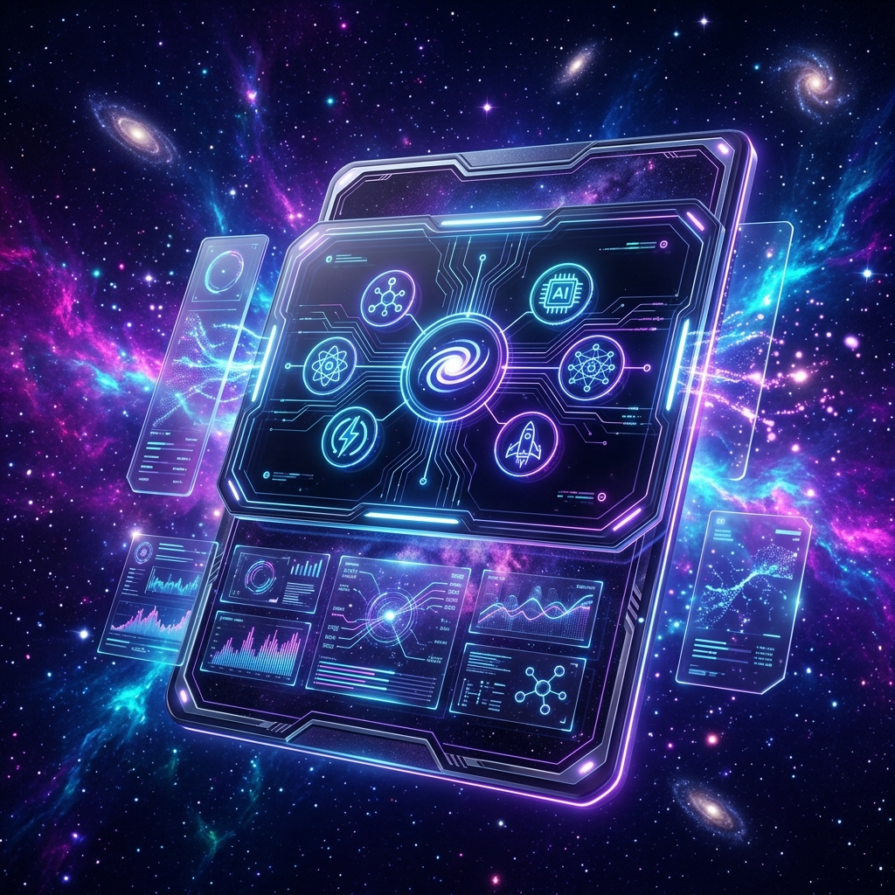

<!-- ═══════════════════════════════════════════════════════════════════════════════════════════════════════ -->
<!--  ARPAN SINGHA - THE GALACTIC EVOLUTION | SOFTWARE ENGINEER & DATA SCIENTIST  -->
<!-- ═══════════════════════════════════════════════════════════════════════════════════════════════════════ -->

<!-- ULTRA-ENHANCED CINEMATIC BANNER -->
<p align="center">
  
</p>

<div align="center">

<!-- COSMIC ANIMATED NAME - STUNNING ORBITRON FONT -->
<a href="https://github.com/arpansingha7">

</a>

<br/>

<!-- SUBTITLE - INTERSTELLAR STYLE -->


<!-- TAGLINE - NEBULA GRADIENT -->


<br/>

<!-- GALACTIC BADGES -->
<p>


</p>

<br/>

<!-- INTERSTELLAR CONNECTIVITY -->
<p>
<a href="https://www.linkedin.com/in/-arpansingha-"></a>
<a href="mailto:arpansingha7@gmail.com"></a>
<a href="https://arpansingha7.github.io/"></a>
</p>

</div>

<!-- DIVIDER -->


<!-- ABOUT SECTION WITH GALACTIC DASHBOARDS -->
<h2>


</h2>

<div align="center">
<table>
<tr>
<td width="55%" valign="top">

```typescript
class ArpanSingha {
  readonly mission = "Democratizing Local Hiring";
  readonly quadrant = "India";
  readonly spectrum = ["Software Engineering", "Data Science"];

  readonly arsenal = [
    "Scalable Real-time Pipelines",
    "Geospatial Euclidean Engines",
    "Predictive Neural Networks",
    "High-Performance Web Core"
  ];

  readonly mindset = {
    optimization: "Haversine Distance Logic",
    accessibility: "AI Voice Registration",
    fluidity: "60FPS Framer Physics"
  };
}
```

</td>
<td width="45%" valign="top">

```yaml
Operational Telemetry:
  ✦ Backend: Node/Express Cluster
  ✦ Database: MongoDB (2dsphere)
  ✦ UI: React/Vite/Tailwind
  ✦ AI: Groq/NLP Integration
  ✦ Real-time: Socket.IO Flux
```

</td>
</tr>
</table>
</div>

<!-- DIVIDER -->


<!-- TECH CONSTELLATION -->
<h2>


</h2>

<div align="center">

<!-- LANGUAGES -->
<p>

</p>

<!-- FRAMEWORKS -->
<p>

</p>

<!-- BACKEND & DB -->
<p>

</p>

<!-- TOOLS -->
<p>

</p>

<p>


</p>

</div>

<!-- DIVIDER -->


<!-- PRODUCTION GALAXY - FEATURED PROJECT -->
<h2>


</h2>

<p align="center">
  
</p>

<table>
<tr>
<td width="60%">

###  Hyperlocal Hiring Platform

> **Geospatial Tracking • Real-time Updates • AI Voice Registration**

A high-performance web platform revolutionizing the hyperlocal market. Engineered for 60FPS fluid interactions and enterprise-grade scalability.

<a href="https://github.com/arpansingha7/SkillBridge"></a>
<a href="#"></a>

<p>


</p>

</td>
<td width="40%">

```typescript
// System Features
{
  haversine_tracking: "Real-time Proximity",
  ai_dictation: "Groq Voice-to-Text",
  kanban_sync: "Socket.IO Persistence",
  ui_physics: "Framer 60FPS Fluidity",
  geospatial: "2dsphere Aggregation"
}
```

</td>
</tr>
</table>

<!-- DIVIDER -->


<!-- GITHUB EVENT HORIZON - ANALYTICS -->
<h2>


</h2>

<p align="center">
  
  
</p>

<p align="center">
  
</p>

<!-- THE 3D CONSTELLATION -->
<p align="center">
  
</p>

<div align="center">
  
</div>

<!-- TROPHY GALAXY -->
<p align="center">
  
</p>

<!-- DIVIDER -->


<!-- INTERSTELLAR CONNECT CHANNELS -->
<div align="center">

```
╔═══════════════════════════════════════════════════════════════════════╗
║                                                                       ║
║   👨‍💻  INTERSTELLAR MANDATE                                             ║
║   ─────────────────────────────────────────────────────────────────   ║
║   ▸ Architecting resilient full-stack constellations                  ║
║   ▸ Engineering democratized AI for localized impact                 ║
║   ▸ Committed to SOLID design and galactic scalability                ║
║                                                                       ║
║   📬  SIGNAL CHANNELS                                                 ║
║   ─────────────────────────────────────────────────────────────────   ║
║   ▸ Signal: linkedin.com/in/-arpansingha-                            ║
║   ▸ Direct: arpansingha7@gmail.com                                   ║
║                                                                       ║
╚═══════════════════════════════════════════════════════════════════════╝
```

<br/>

<p>
  <a href="https://www.linkedin.com/in/-arpansingha-">
    
  </a>
  <a href="mailto:arpansingha7@gmail.com">
    
  </a>
</p>

</div>

---

<p align="center">
  
</p>

<!-- GALACTIC FOOTER -->

